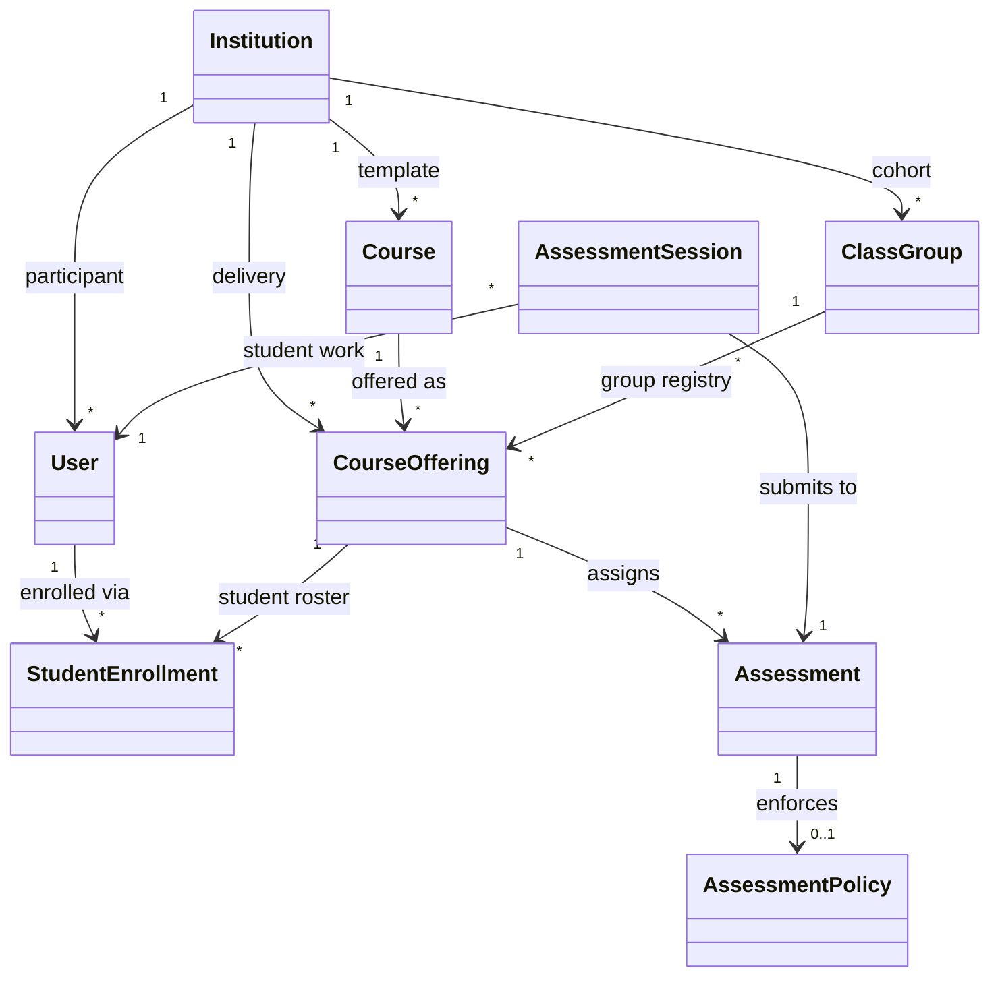

# OWS Educational Data Model

This document outlines the design and structural relations of the multi-tenant educational domain foundation introduced to the Open Work Standard (OWS).

---

## Data Model Architecture

The multi-tenant domain represents standard higher education and training topologies, isolating institutions, courses, classes, enrollments, and validation policies.

### Entity Relationship Diagram

---

## Core Entities and Definitions

### 1. Institution
Represents a university, school, organization, or educational tenant.
- **Key Fields**: `InstitutionId`, `Name`, `Slug`, `CreatedAt`.
- **Purpose**: Provides the top-level isolation boundary for educational metadata.

### 2. Course vs. CourseOffering
- **Course**: Represents the *reusable abstract identity* of a subject (e.g. "Distributed Systems" or "Introduction to Algorithms"). It holds course codes and titles, remaining static across semesters.
- **CourseOffering**: Represents a *specific delivery* of a course in a given term and year to a target class group (e.g. "Distributed Systems, Spring 2026, Cohort Section A").

### 3. ClassGroup vs. Course
- **Course**: An academic subject of study.
- **ClassGroup**: Represents a *cohort of students* moving through a curriculum (e.g. "CS Major Class of 2026", "Section B", or "Informatics Lab Group 3"). A ClassGroup is assigned to specific CourseOfferings to register the cohort for that delivery.

### 4. User and StudentEnrollment
- **User**: Represents a person record inside an institution. In the current education model this is primarily used for students referenced by assessments, sessions, and student enrollments.
- **StudentEnrollment**: Connects a student `User` to a specific `CourseOffering`. It is academic membership, not an authorization concept.

### 5. Assessment
Represents an assignment, project milestone, or exam assigned to students under a specific CourseOffering. It may optionally be bound to an `AssessmentPolicy` regulating validation settings.

### 6. AssessmentPolicy
Specifies the OWS verifier tolerances and constraints for an assessment:
- Target heartbeat frequency
- Grace interval limits
- Significant lease gap threshold
- Requirement of remote receipt notarization
- Requirement of verifier session-head anchoring

---

## Verifier Session & Package Linkage

### AssessmentSession
The `AssessmentSession` entity serves as the bridge between the educational model and OWS evidence verification output:
- **`AssessmentId`**: Identifies the assignment.
- **`StudentUserId`**: Identifies the student submitting the work.
- **`Id` (AssessmentSessionId)**: Maps directly to the low-level OWS Verifier `SessionId` created during notarization.
- **`PackageId`**: Tracks the generated `.owspkg` submission.
- **`TrustStatus`**: Records the verified grade (`Verified`, `Degraded`, `Unverified`, `Invalid`).

---

## Deferred Authentication and SaaS Concerns

OWS maintains a **local-first architecture**. To keep the verifier core platform-independent and secure:
- **Deferred Auth**: Passwords, OAuth/OIDC configurations, SSO integrations, and SAML mappings are intentionally left out of `Ows.Core`. 
- **Rationale**: User records are modeled using identifiers and display names. Integrations with LMS platforms (Canvas, Blackboard, Moodle) or Identity Providers (IdPs) should occur in outer application/API gateway layers or dedicated integration microservices rather than within the core domain engine.

---

## Student Membership vs Authorization

- **StudentEnrollment** is academic membership data. It answers "which student belongs to which course offering?"
- **API/RBAC roles** such as `Operator`, `InstitutionAdmin`, `InstructorReviewer`, and `StudentClient` are verifier authorization roles. They answer "what is this caller allowed to do?"
- These are intentionally separate. OWS does not use student enrollment records for verifier permissions.

If course staff membership is needed later, add a separate model instead of reloading `StudentEnrollment` with fake flexibility:
- `CourseStaffAssignment`
- `CourseStaffRole`: `Instructor`, `TeachingAssistant`, `CourseAdmin`, `Observer`
