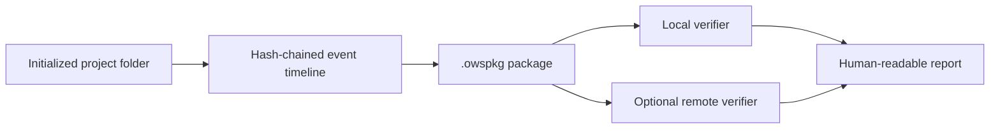

# OWS Provenance Data Model

OWS models project-scoped evidence and verification state. Institutional systems may attach opaque identifiers, but OWS does not store or resolve institutions, courses, rosters, students, or assessments.

## Core evidence flow

## Core records

### Project configuration

`.ows/config.json` identifies an explicitly initialized project and may contain the verifier URL plus optional external context identifiers. These values are metadata, not OWS-managed entities.

### Timeline event

An event records project-scoped activity such as file changes, watcher lifecycle, builds, tests, runs, checkpoints, and recovery scans. Events form a hash chain and never imply that missing activity is misconduct.

### Session

A session links local evidence to optional receipt issuance. It may carry opaque `institutionId`, `assessmentId`, `studentUserId`, and `courseOfferingId` values for external scoping and reporting.

### Package

An `.owspkg` contains the manifest, event timeline, receipts, session metadata, and opaque artifact metadata required for offline verification. Binary files remain opaque and hash-only.

### Verification result

The verifier reports package integrity, timeline integrity, receipt alignment, lease continuity, anchor state, trust status, findings, and optional opaque context identifiers. It does not resolve names, enrollments, course structures, or assessment policies.

## Boundary

Authentication and authorization may use institution and student identifiers to scope verifier resources. That is a trust-boundary concern, not an education-management model. LMS integration, roster synchronization, grading, and institutional administration belong in separate future projects.
